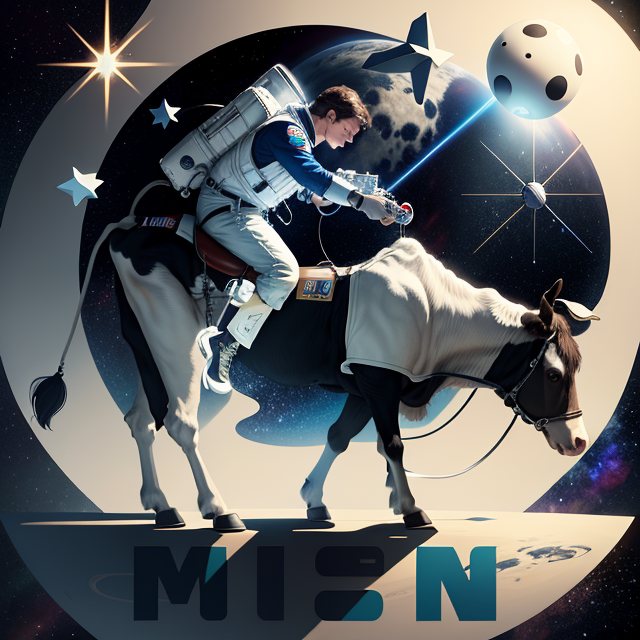

# **Guardiões do Bem e do Leite**

## Brasão da Facção

 

## O que faziam antes do **Bem e do Leite**?

- **Arthur**: Arthur é originário de um planeta outrora próspero que foi dominado e exaustivamente explorado pelas grandes corporações intergaláticas. Devido a essa exploração, a civilização de seu planeta entrou em confronto com essas corporações e foi covardemente massacrada, o que causou uma diáspora de seu povo pela galáxia. Em decorrência dessa guerra, Arthur encontrou muitas dificuldades para sobreviver, restando-lhe a vida de ladrão. No entanto, essa jornada tumultuada o levou a encontrar o grupo que eventualmente se tornaria os Guardiões do Bem e do Leite,  que o ajudaria a amenizar a raiva que a vida lhe infligira. (Dá cobertura aos membros do grupo, ajuda quando o caldo engrossa)

- **Leandro**: Leandro é um garoto ingênuo que veio de um planeta distante chamado Atumalaka, após ficar endividado em uma plataforma chamada Drazino 666. Teve que se submeter a diversos serviços questionáveis para quem dera um dia pudesse pagar a sua dívida. Porém uma oportunidade de ouro surgiu para quitar esse déficit, Mateus lhe convidou para um roubo mirabolante que finalmente trará liberdade ao nosso rapaz. (passa pelos cenários despercebidos - stealthing).

- **Lucas**: Lucas é um ladrão. Apesar de ser muito inteligente, prefere roubar dos outros do que conquistar as coisas por seu próprio mérito. “Para que trabalhar que eu já posso pegar pronto?” era seu lema de vida. Por não chamar muita atenção dos outros e ser um analista nato, sua especialidade era a furtividade, podendo entrar e sair de lugares sem ser notado e sem parecer com um possível suspeito, por aparentar ser inofensivo e ter uma personalidade agradável. Além disso, era a mente que ficava por trás dos planos, criando estratégias e planos para os objetivos. Era amigo da líder, e, portanto, convidá-lo para missões era algo natural. Por se gabar muito de sua inteligência, criou o hábito de misturar inglês com português, algo similar aos antigos “coaches”, acreditando que isso o tornaria mais intelectual aos olhos de outras pessoas. Infelizmente, isso só faz com que outros tenham dificuldade em compreender suas ideias. Apesar de querer ter uma vida mansa sem muito esforço, quando quer algo, se dedica de corpo e alma até conseguir. (Cria os planos e se infiltra nos lugares)

- **Mateus**: Anteriormente um praticante de artes marciais em um dos mais remotos períodos da humanidade, Mateus ao ser amaldiçoado por uma aberração do mal, teve seu corpo e alma teletransportado para um tempo distante no futuro, onde agora, devido a maldição carregada por si, mantém um corpo imortal, permitindo o assim, correr atrás de respostas e de sabedoria sobre o que fazer com aquele que lhe lançou tal mal. Em  sua jornada, Mateus manteve seu carisma e sua perseverança guiarem sua trajetória, fazendo amigos e ajudando aqueles que podia. Outrora um ninja do passado, hoje um sucinto estrategista que usa de sua astúcia para se dar bem neste futuro distópico, e assim ajudar aqueles que passam pelo seu caminho. (Estrategista de mão cheia, além de ajudar quem precisa, e descer a porrada no resto)

- **Maria Alice**: Enquanto participava de um experimento na faculdade em troca de biscoitos, Maria Alice foi acidentalmente teletransportada para um futuro distante e assustador. Sem poder voltar para sua época, sem seus amigos e família, ela vagou pelo planeta desértico sobrevivendo com o que encontrava pelo caminho. Como forma de suprir a saudade que sentia a todo momento, se apegou a todas as pessoas que encontrou pelo caminho e buscava todas as formas possíveis de protegê-las. Com o tempo ela criou uma pequena comunidade para abrigar pessoas perdidas assim como ela em seu recomeço.

- **Millena**: Millena era uma profissional dedicada na renomada empresa Choquei, mas sua paixão secreta sempre foi a tecnologia. Um dia, ela decide dar uma reviravolta em sua vida e trocar sua carreira corporativa para se tornar uma hacker de Facebook, desafiando os estereótipos de gênero no mundo da cibersegurança. Com determinação, Millena aprimora suas habilidades até se tornar uma hacker talentosa e notável. Entretanto, a ganância toma conta da personagem e, a partir de ameaças de exposed, convence cinco personagens de diferentes planetas a embarcar em uma missão milionária.

 

## Como se reuniram?

Millena estava à procura de integrantes para realizar um assalto à uma nave de um grupo que estava ganhando notoriedade por realizar boas ações pelo universo, visando ganhar muito dinheiro vendendo a nave e o que mais conseguissem encontrar lá dentro. Tal grupo atendia pelo nome Guardiões do Bem e Do Leite, porém como todos os integrantes usavam trajes espaciais e moduladores de voz, ninguém conhecia suas reais identidades.

Era sabido que esse grupo de benfeitores iria participar de uma festa no planeta do líder da operação do roubo. Com essa oportunidade em mãos, nossos personagens se infiltraram no evento. Se infiltrando como o barista do local, Lucas batizou as bebidas dos integrantes. Com os patrulheiros espaciais desacordados, seus trajes foram roubados.

Os ladrões, adentrando a nave, logo começaram a vasculhar por qualquer coisa de valor que pudessem vender ou que simplesmente chamassem a atenção. Porém, ingenuamente, Maria Alice apertou um chamativo botão vermelho, que ativou a nave e a colocou em curso para o Comando Estelar, que seria o próximo destino de Guardiões do Bem e Do Leite.

Ninguém ali sabia pilotar uma nave, logo não poderiam voltar. Ao perceberem a gravidade da situação e que teriam sérios problemas com as autoridades caso fossem descobertos, os personagens decidiram tomar a seguinte decisão: se passar pelos patrulheiros benevolentes.

Como haviam estudado eles e estavam com seus trajes e vozes, havia ali uma chance mínima de isso dar certo. Mas ninguém sabe dizer com certeza se isso iria funcionar.
O fato é: quando a nave aterrissou e as portas abriram, um novo e improvável grupo de “heróis” havia surgido, que ajudaria o Comando Estelar a proteger o universo… para não serem entregues à polícia.

Lucas ficaria na parte de inteligência e em missões furtivas, juntamente com Leandro. Millena, com sua experiência em invasão de sistemas, poderia ajudar na quebra de criptografia de arquivos protegidos e invasão de sistemas do grupo Apache. Mateus, sendo um estrategista, ajudaria com a organização e manutenção de toda a operação. Mateus e Arthur ajudariam em caso de conflito, dando suporte na linha de frente. Maria Alice, por sua vez, ajudaria em situações de diplomacia.

##  Histórico de Versão:

| **Data** | **Versão** | **Descrição** | **Autor** |
| :--------: | :--------: | :--------:  | :--------: | 
| 25/10/2023 | 1.0 | Inclusão da História no GitPages  | [Maria Alice](https://github.com/Maliz30)  |
