
<h1>Construção de PBB para o HealthNet</h1>

O PBB (Product Backlog Building) é um método e um Canvas para a elaboração e a criação de um Product Backlog.

Abaixo está o PBB desenvolvido pela equipe para o caso de estudo HealthNet.

## Canvas PBB

<iframe width="768" height="432" src="https://miro.com/app/live-embed/uXjVNdWXokk=/?moveToViewport=16919,-2580,23064,9167&embedId=926171505607" frameborder="0" scrolling="no" allow="fullscreen; clipboard-read; clipboard-write" allowfullscreen></iframe>

## Problemas e Expectativas

 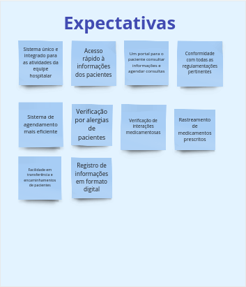

## Personas

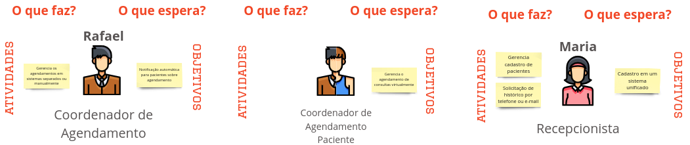

## Funcionalidades

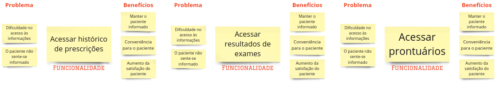

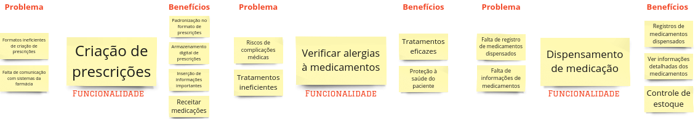
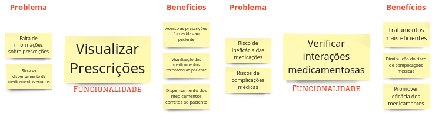

## PBI's

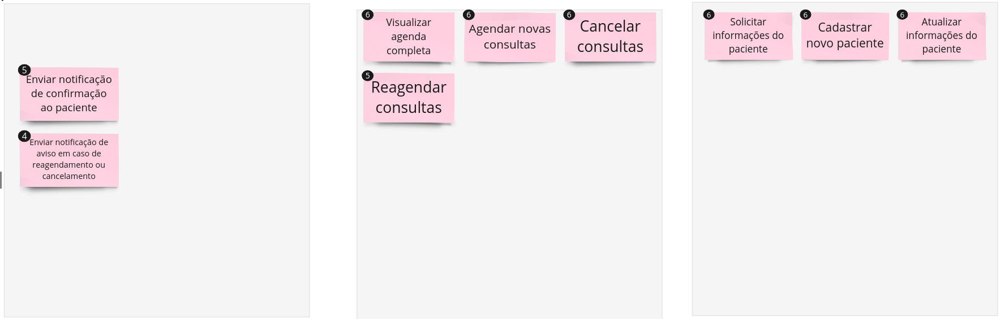
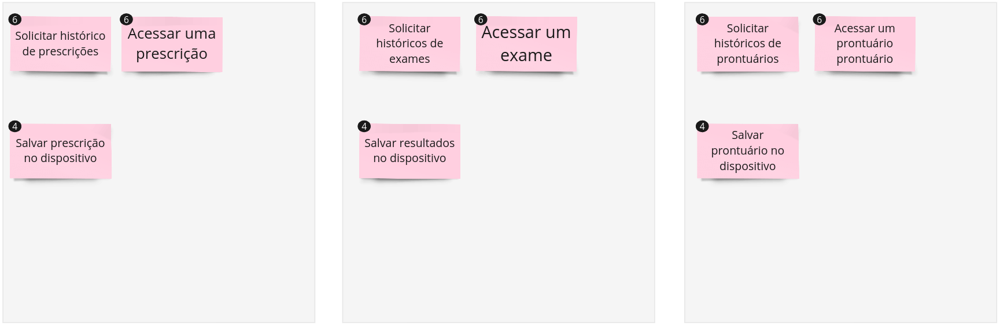
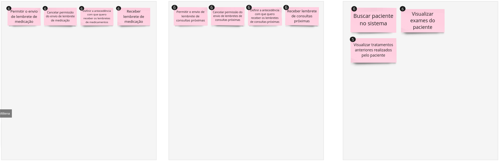
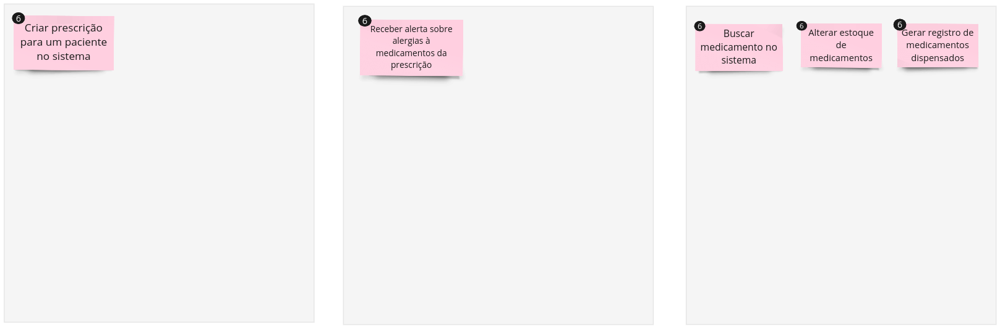
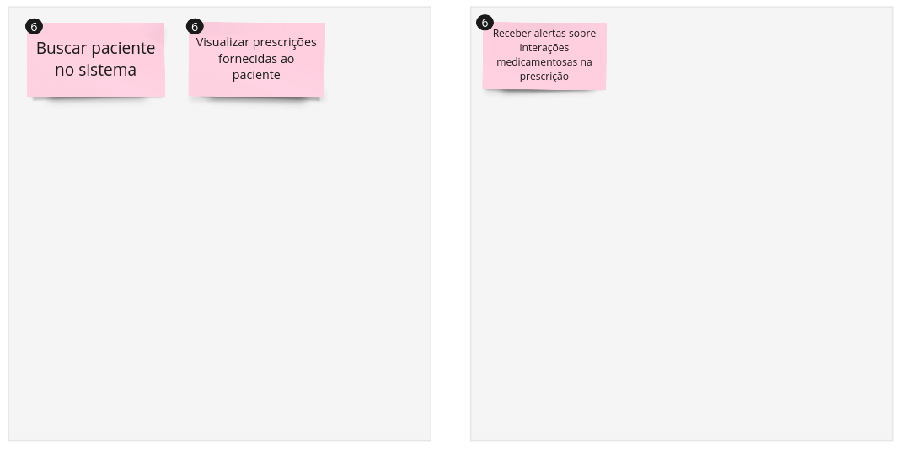

## Histórias de Usuário & Critérios de Aceitação

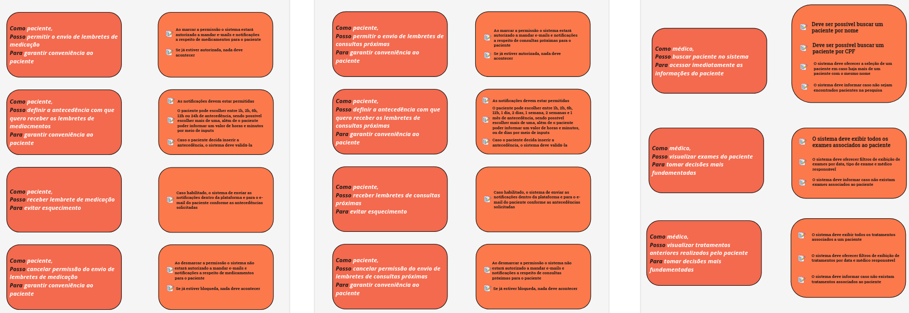
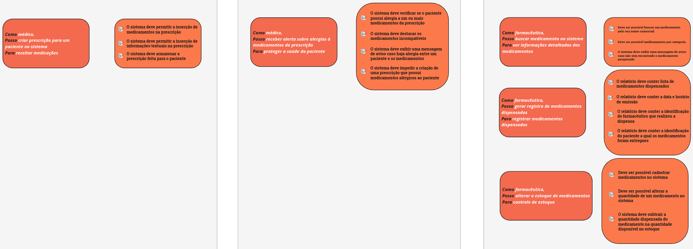
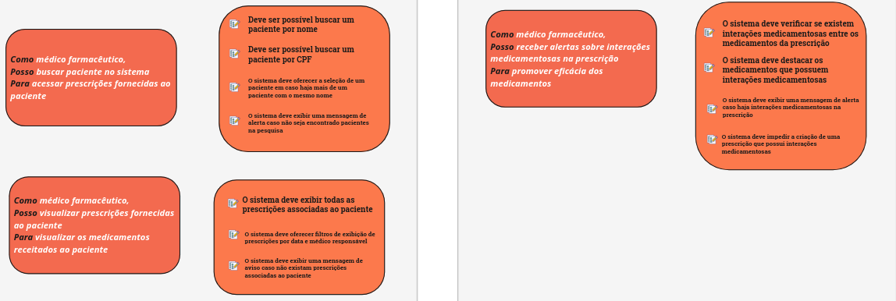

##  Histórico de Versão:

| **Data** | **Versão** | **Descrição** | **Autor** |
| :--------: | :--------: | :--------:  | :--------: | 
| 22/11/2023 | 1.0 | Inclusão do PBB no GitPages  | [Arthur Grandão](https://github.com/arthurgrandao)  |