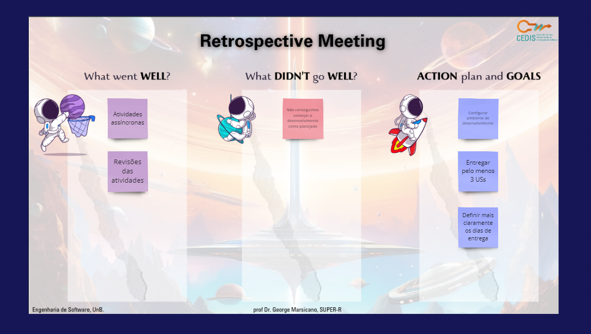
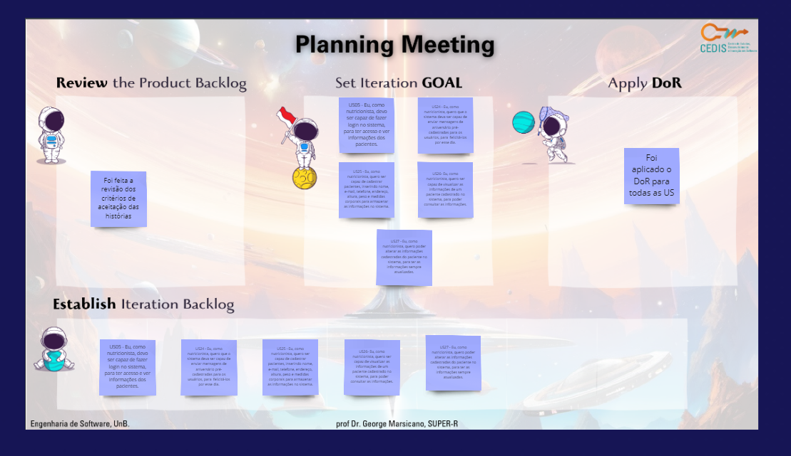
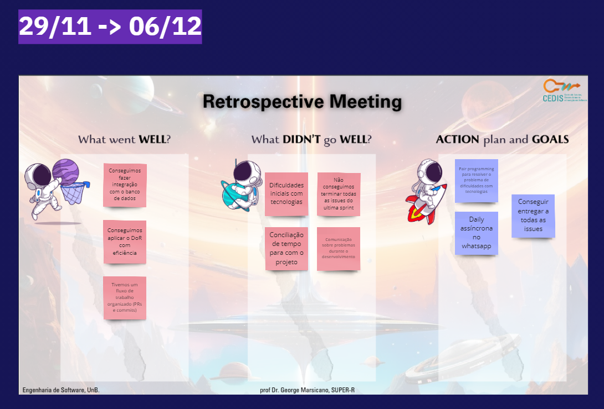
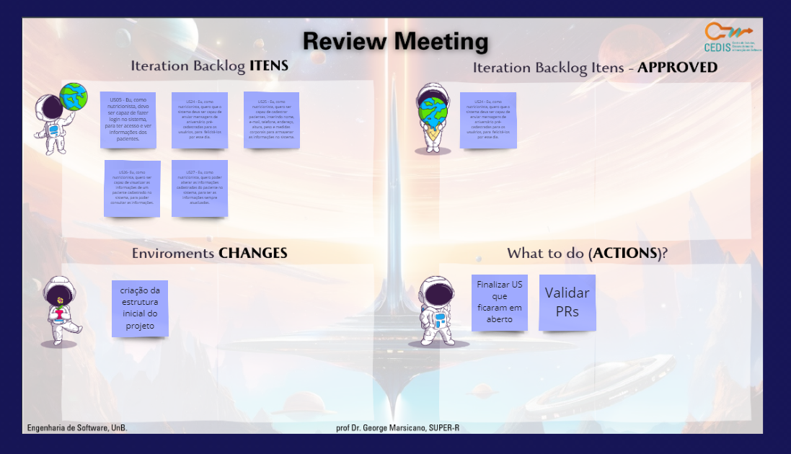
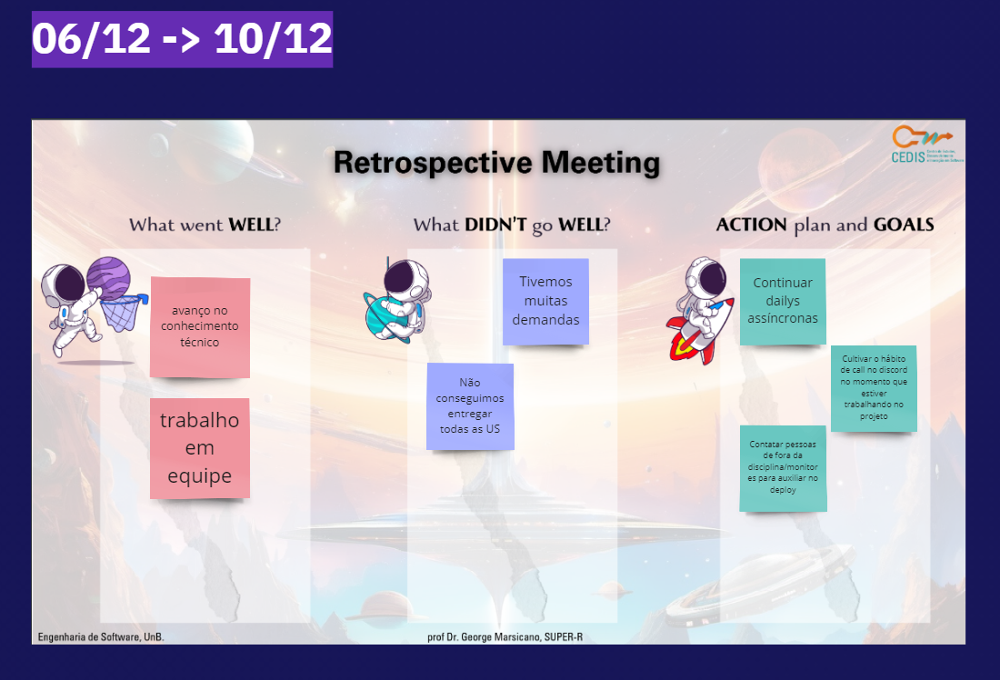
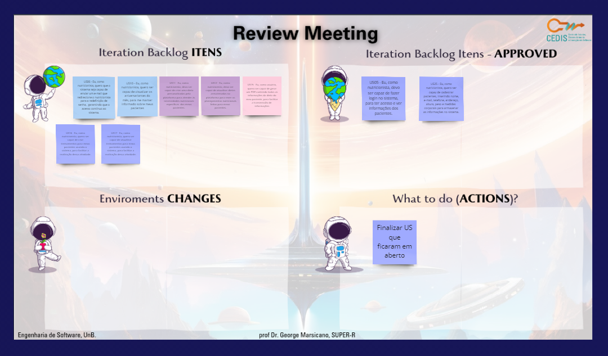
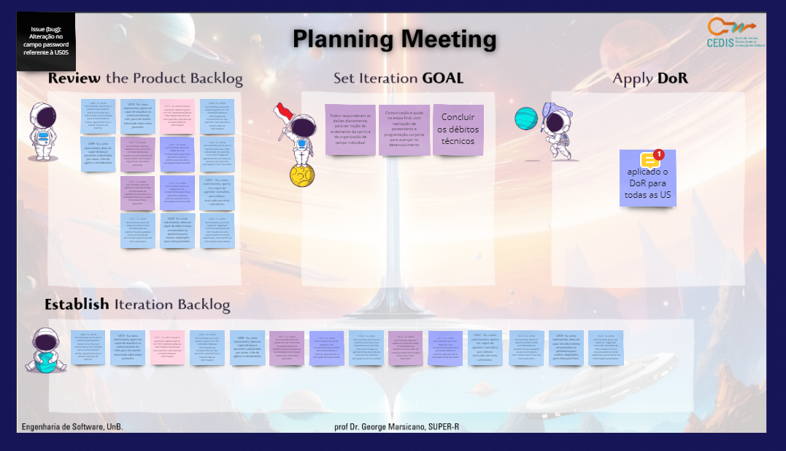

# Visualização no Miro

<iframe width="768" height="432" src="https://miro.com/app/live-embed/uXjVNdWXokk=/?moveToViewport=40445,786,6648,3862&embedId=37104519803" frameborder="0" scrolling="no" allow="fullscreen; clipboard-read; clipboard-write" allowfullscreen></iframe>

# Templates preenchidos

##  Histórico de Versão:

| **Data** | **Versão** | **Descrição** | **Autor** |
| :--------: | :--------: | :--------:  | :--------: | 
| 11/12/2023 | 1.0 | Criação do documento  | [Mateus Fidelis](https://github.com/MatsFidelis)  |