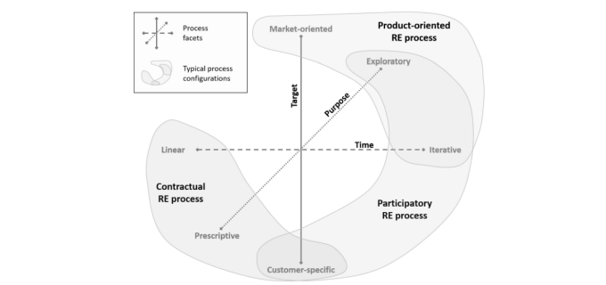

##  Problema:
- A nossa metodologia de desenvolvimento de software será ágil, baseado no ciclo de vida **iterativo/incremental** com o processo de desenvolvimento sendo o **Rapid Application Development (RAD)**.  A escolha se deu com base nos critérios apresentados por **GUPTA (2019)** que englobam características dos requisitos, status da equipe de desenvolvimento, envolvimento do usuário, tipo de projeto e risco associado.
- Em relação ao processo de engenharia de requisitos, **IREB (2022)** apresenta um diagrama que abrange os aspectos do processo de ER. Este diagrama foi a referência para a escolha de um processo de engenharia de requisitos participativo:

- O produto será **orientado ao cliente**, apesar de ser uma ferramenta que pode vir a atender necessidades de outros profissionais da saúde, tem-se requisitos muito voltados a necessidade específica do cliente e não está sendo feita uma pesquisa de mercado com intuito de disponibilizar a ferramenta para outros profissionais.
- O tempo do processo será **iterativo**, visto que os requisitos ainda não são totalmente conhecidos e vão ser evoluídos ao longo do projeto. Além disso, o constante feedback por parte do cliente é de suma importância para adaptarmos os requisitos conforme a necessidade dele.
- Já o propósito será **exploratório** visto que as partes interessadas terão participação ativa em todo processo e teremos os requisitos em constante evolução.

- A seguir será listado como cada uma das atividades de ER será realizada com base nas etapas do RAD (conforme visto no diagrama acima):

##  Planejamento de requisitos

Fase focada em encontrar, extrair, obter ou provocar uma resposta, reação, informação dos usuários para construção dos requisitos, analisar os requisitos brutos e conciliar os interesses dos stakeholders, além de comunicar os requisitos para os interessados em diferentes níveis de glanularidade e dividindo entre funcionais e não funcionais. (MARSICANO, 2023).

| Atividade | Método | Ferramenta | Entrega |
| :--------: | :--------: | :--------: | :--------: |
|  Elicitação e Descoberta | Brainstorming | Miro | Backlog dos Requisitos Brutos |
|  Análise e Consenso | Reunião síncrona do time e análise de requisitos | Discord e Miro | Backlog dos Requisitos validados |
|  Declaração | Separação por granularidade, como Épicos, Capacidades, Features e user stories (formato de user story: “Como um <tipo de usuário>, quero <algum recurso>, para que <algum motivo>) | Miro | Todos os requisitos representados em user stories |

##  User Design

- Nessa fase tem-se a criação de protótipos do sistema com base nos requisitos coletados e que posteriormente será apresentado ao cliente para coleta de feedback.

| Atividade | Método | Ferramenta | Entrega |
| :--------: | :--------: | :--------: | :--------: |
|  Representação | Prototipação em Ferramenta de design | Figma | Protótipo de Alta Fidelidade |

##  Construção
- Na fase de construção tem-se a implementação do sistema com base no protótipo e história de usuário validado, testes e integração de componentes.

| Atividade | Método | Ferramenta | Entrega |
| :--------: | :--------: | :--------: | :--------: |
| Verificação e Validação | Checklist, DEEP e INVEST | Miro e Google Docs| Backlog na estrutura SAFe |

##  Transição

- A transição é a fase final do nosso processo e envolve a transição do sistema desenvolvido para a produção, garantindo que ele esteja pronto para uso pelo usuário final, a partir de um teste de aceitação. 

| Atividade | Método | Ferramenta | Entrega |
| :--------: | :--------: | :--------: | :--------: |
|  Organização e Atualização | Análise de valor de negócio | Google sheets | Backlog priorizado e Proposta de MVP |

##  Histórico de Versão:

| **Data** | **Versão** | **Descrição** | **Autor** |
| :--------: | :--------: | :--------:  | :--------: | 
| 23/09/2023 | 1.0 | Criação do Documento  | [Mateus Fidelis](https://github.com/MatsFidelis)  |
| 28/09/2023 | 1.1 | Adição de imagens e edição de textos  |  [Mateus Fidelis](https://github.com/MatsFidelis)  |
| 28/09/2023 | 1.2 | Adição de informações quanto aos processos e planejamento do RAD |  [Mateus Fidelis](https://github.com/MatsFidelis)  |
| 25/10/2023 | 1.3 | Ajustes no planejamento de requisitos, construção e transição | [Maria Alice](https://github.com/Maliz30) |
