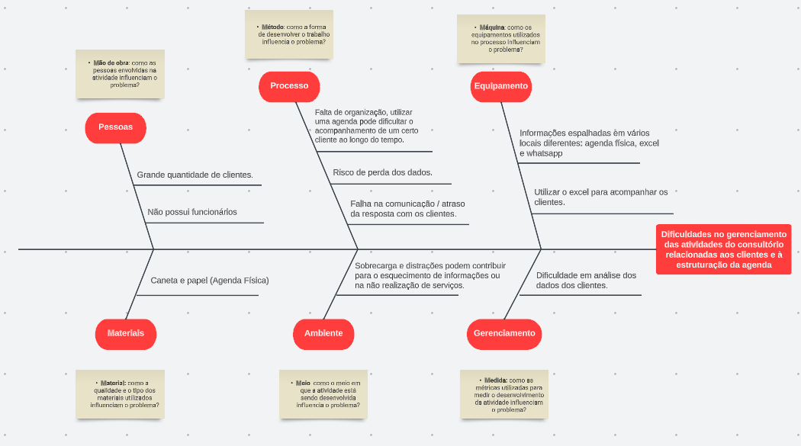

##  Problema:

- A oportunidade identificada foi uma atividade de **consultoria** de nutrição e musculação. A negócio em questão envolve um grande número de clientes e necessita de **organização** em vários aspectos, como as datas de retorno do cliente para acompanhamento de seu progresso, plano contratado (trimestral ou semestral), dentre outros.
- Nota-se que, devido à falta de funcionários e à falta de um software que atenda o seu negócio, o cliente fica com toda a responsabilidade de estruturar essas informações para si, tendo que usar soluções próprias para suas necessidades, como Excel ou mesmo uma agenda física. Logo, percebe-se que uma **solução em software** pensada especificamente para o cliente facilitaria muito o seu ambiente de trabalho.

##  Declaração de Posição do Produto:

- O produto a ser desenvolvido será um software voltado para o **gerenciamento** de um negócio de consultoria de nutrição e musculação, permitindo que o usuário cadastre clientes e todas as informações relevantes a respeito do mesmo, como dieta, treinamento e suplementação recomendadas, além de lembrar o profissional de datas importantes, a exemplo, retorno do cliente para nova consulta de acompanhamento (e permitir controle da realização dessas mesmas consultas).
- Além disso, envio automático de e-mails para os clientes do estabelecimento, facilitando a **comunicação** entre o nutricionista e seu paciente.

- O diferencial do produto é atender diferentes necessidades em um ambiente só. Devido às várias nuances dessa atividade, o profissional precisa recorrer a diferentes softwares para poder **gerenciar** suas informações, fragmentando-as em diferentes partes. Ao oferecer um **ambiente único**, remove-se a necessidade da utilização e aprendizagem de diferentes sistemas e é favorecido a organização dos dados, pois estarão todos em um só ambiente.

- Os **usuários-alvo** deste produto são os nutricionistas e profissionais de educação física que possuem uma clínica ou que trabalham com o desenvolvimento de dietas.

- Ao utilizar esse produto, o usuário irá precisar mais de ferramentas e softwares diversos para **administrar** seu empreendimento.

| Para | Nutricionistas e profissionais de Educação Física |
| --- | --- |
| Quem | Tem dificuldades de gerenciar as atividades do consultório |
| O (nome do produto) | NutriPlanner é voltado para a área de saúde |
| Que | busca auxiliar o gerenciamento de consultas e proporcionar ferramentas que auxiliem a realização das consultas |
| Ao contrário | Do excel e da agenda física |
| Nosso produto | Organiza informações diretamente em emails e calendários, como o gmail e o google agenda. |

##  Objetivos do Produto:
- O objetivo central desse produto é **ajudar** profissionais da área de saúde que precisam **organizar** dietas para seus clientes de forma **prática** e organizada, ao contrário de métodos convencionais, como planilhas e agendas. 

##  Tecnologias utilizadas:

| Tecnologia | Propósito |
| :--------: |  :--------: |
| **Front-end** | Foi escolhido o framework **React.Js**,  que é utilizado para construção de interfaces de usuário em páginas web. |
| **Back-end** | O **Node.js** é um ambiente de execução do código JavaScript com o objetivo de criar servidores. |
| **Banco de Dados** | Foi escolhido o **MongoDB** é um sistema gerenciador de banco de dados orientado a documentos. |

##  Ferramentas utilizadas:

| | Ferramenta | Propósito |
| :--------: | :--------: | :--------: |
|    | WhatsApp | Comunicação assíncrona entre o time e com o cliente |
|    | Google Meets | Reuniões síncronas com o cliente |
|    | Discord | Comunicações e registros de informações internas / Pareamentos |
|    | Google Drive | Armazenamento e manuseio de documentos |
|    | Github | Repositórios de documentação e código do projeto |

##  Histórico de Versão:

| **Data** | **Versão** | **Descrição** | **Autor** |
| :--------: | :--------: | :--------:  | :--------: | 
| 23/09/2023 | 1.0 | Criação do Documento  | [Mateus Fidelis](https://github.com/MatsFidelis)  |
| 28/09/2023 | 1.1 | Adição de imagens e edição de textos  |  [Mateus Fidelis](https://github.com/MatsFidelis)  |
| 28/09/2023 | 1.2 | Alteração nos índices e na formatação da documentação  |  [Mateus Fidelis](https://github.com/MatsFidelis)  |
| 24/10/2023 | 1.3 | Adição do diagrama de Ishikawa  |  [Maria Alice](https://github.com/Maliz30)|
| 24/10/2023 | 1.4 | Adição do Google Meets em Ferramentas |  [Lucas Spinosa](https://github.com/LucasSpinosa)  |
