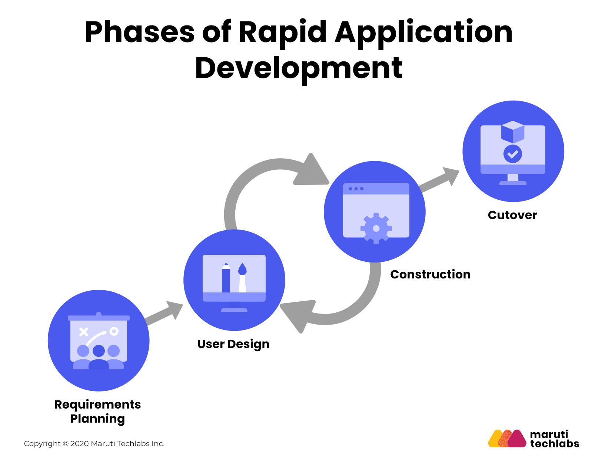

##  Abordagem de desenvolvimento de software -> ESW:

- Para a realização deste projeto, foi decidido que será implementado a abordagem **ágil** de desenvolvimento devido a suas características. 
- A abordagem ágil possui um ciclo de vida **iterativa** e **incremental**, onde o produto é desenvolvido em partes, com entregas contínuas e frequentes, permitindo um maior acompanhamento do cliente no desenvolvimento do produto e que possa dar feedbacks para a equipe de desenvolvimento de forma mais eficaz. 
- A partir disso, seguindo escolhas da equipe e príncipios de Sommerville em sua escrita, decidimos aplicar o processo de desenvolvimento **RAD (Rapid Application Development)**, que é um processo de desenvolvimento de software que prioriza a entrega rápida de um produto de software de alta qualidade, com o objetivo de atender as necessidades do cliente.

##  Organização do Projeto:

| Papel | Atribuições | Responsável | Participantes |
| --- | --- | --- | --- |
| Desenvolvedor | Codificar o produto, codificar testes unitários, realizar refatoração | Maria Alice | Todos |
| Dono do Produto | Atualizar o escopo do produto, organizar o escopo das sprints, validar as entregas | Lucas | Todos |
| Analista de Qualidade | Garantir a qualidade do produto, garantir o cumprimento do conceito de pronto, realizar inspeções de código | Millena | Todos |
| Cliente | Fornecer feedbacks para a equipe de desenvolvimento sobre o que está sendo desenvolvido, elicitar requisitos do produto | Leonardo | ... |
| Analista de Requisitos | Realizar a elicitação de requisitos, trabalhar no consenso e definição dos mesmos, realizar formas de declaração e representação, trabalhar na verificação e validação e manter o fluxo de informações organizados e atualizados | Mateus Fidelis | Todos |

##  Planejamento das Fases e/ou Iterações do Projeto:
- Nosso ciclo de vida será iterativo/incremental, seguindo o cronograma com o seguinte planejamento:

| Ciclo | Atividades realizadas | Entrega | Data Início | Data Fim |
|:-----:|:---|:-----:|:-----:|:----:|
| Fase 1 | **REQUIREMENTS**   Atividades de Elicitação, descoberta e Declaração com técnica de Documento de visão de Produto | Visão de Produto e Projeto ; Declaração do Problema | 11/09/23 | 22/09/23 |
| Fase 1 | **REQUIREMENTS**   Atividades de Elicitação e descoberta com técnica envolvendo Entrevista e Análise de Tarefas | Lista de Necessidades ; Lista de Requisitos Funcionais ; Lista de Requisitos Não-funcionais | 02/10/23 | 13/10/23 |
| Fase 1 | **REQUIREMENTS**   Atividades de Elicitação, descoberta, verificação e validação com técnicas envolvendo Entrevista, SAFe  |  Resultados INVEST ; Resultados do Checklist ; Backlog SAFe ; Proposta de MVP  | 16/10/23 | 27/10/23 |
| Fase 2 | **USER DESIGN**   Atividades de Representação com técnicas envolvendo protipagem | [Protótipo de alta Fidelidade](https://www.figma.com/file/SdSUndWHyHGKgN72tfiNib/Protótipo-de-alta-fidelidade?type=design&node-id=0-1&mode=design&t=X4kspsvCG9bh51MR-0) | 30/10/23 | 10/11/23 |
| Fase 3 | **CONSTRUCTION**   Atividades de Verificação e Validadação com técnicas envolvendo Checklists de Verificação e Validação e Feedback com o usuário |  Checklist DoR e DoD ; Critérios de Aceitação das US ; Configurações iniciais do projeto (preparo do ambiente de desenvolvimento)  | 13/11/23 | 24/11/23 |
| Fase 4 | **USER DESIGN**   Atividades de Verificação e Validação com técnicas envolvendo BDD e checklist DoR e DoD | [Protótipo de alta Fidelidade](https://www.figma.com/file/SdSUndWHyHGKgN72tfiNib/Protótipo-de-alta-fidelidade?type=design&node-id=0-1&mode=design&t=X4kspsvCG9bh51MR-0) | 24/11/23 | 26/11/23 |
| Fase 5 | **CONSTRUCTION**   Atividades de Verificação e Validadação com técnicas envolvendo Checklists de Verificaçãoe Validação e Feedback com o usuário |  Checklist DoR e DoD ; Critérios de Aceitação das US ; Desenvolvimento das US | 27/11/23 | 05/12/23 |
| Fase 6 | **CUTOVER**   Verificação e Validação com o usuário | Teste de Usabilidade | 05/12/23 | 14/12/23 |

Vale citar que teremos reuniões de validação com o cliente e com o professor ao longo do projeto. Também teremos pontos de controle para verificar se o andamento do desenvolvimento está conforme o esperado, a serem realizados nas seguintes datas:

- Ponto de Controle 1 (Professor): 14/11/23
- Ponto de Controle 2 (Professor): 05/12/23

##  Matriz de Comunicação:

Foi decidido que, semanalmente, serão realizadas reuniões entre os integrantes da equipe para acompanhamento das atividades que estão sendo executadas. Atas de reunião serão confeccionadas pelo líder da equipe com a mesma periodicidade.

Em acordo com o cliente, o contato com o mesmo ocorrerá de forma assíncrona pelo WhatsApp. Vale notar que ele se prontificou para participar de reuniões com a equipe de desenvolvimento uma vez por semana, caso seja necessário, pelo Google Meets.

| Descrição | Área / Envolvidos | Periodicidade| Produtos Gerados |
| --- | --- | --- | --- |
| Acompanhamento de atividades em desenvolvimento | Equipe | Semanal | Kanban no GitHub Projects |
| Reuniões Gerais | Equipe | Semanal | Ata de reunião |
| Alinhamento com Cliente | Equipe / Cliente | Semanal | Relatório de Considerações do Cliente |
| Situação do Projeto | Equipe / Professor | Pontos de Controle | Ata de reunião, apresentação com feedbacks |

##  Gerenciamento de Riscos:
    
Dentre os riscos enfrentados na missão 1 estão:

- Incompatibilidade com os horários dos membros;
    - Ação para mitigar: Criação de heatmap para verificação de horários dos membros da equipe e do cliente, para assim encontrar uma data/horário que seja melhor compatível.
- Falta de conhecimento entre as tecnologias escolhidas;
    - Reuniões síncronas online entre os participantes para estudo em conjunto.
    - Ao final de cada iteração, realizar um levantamento de possíveis aspectos a serem tratados futuramente, a serem datados e anotados em documentação presente no drive, para que possa haver tempo ábil de estudo.
    - Pair Programming para maior eficiencia e aproveitamento do conhecimento da equipe.

##  Critérios de Replanejamento:

| Tipos de Risco    | Descrição     | Ação para contingenciar |  Impacto |
| :--------: | :--------: | :--------: | :--------: |
| Escopo | Mesmo depois de todo o processo de concepção e produção da solução através do processo RAD, o cliente não estar satisfeito com a entrega | Estar em constante contato com o cliente e buscar aplicar bem as etapas do RAD | Médio |
| Prazo | Caso a equipe seja reduzida a metade da sua composição original | Replanejar o escopo do projeto e o cronograma | Alto |
| Entrega | A falta de conhecimento com as tecnologias pode atrasar as entregas, levando a necessidade de um novo escopo de tempo e projeto a ser executado pela equipe | Realizar estudos e ações conuntas para mitigar a falta de saber da equipe | Médio |

##  Histórico de Versão:

| **Data** | **Versão** | **Descrição** | **Autor** |
| :--------: | :--------: | :--------:  | :--------: | 
| 23/09/2023 | 1.0 | Criação do Documento  | [Mateus Fidelis](https://github.com/MatsFidelis)  |
| 28/09/2023 | 1.1 | Adição dos primeiros dois ciclos de planejamento e adição de imagens |  [Mateus Fidelis](https://github.com/MatsFidelis)  |
| 28/09/2023 | 1.2 | Alteração nos índices de replanejamento, e aumento da descrição das ações para contigência |  [Mateus Fidelis](https://github.com/MatsFidelis)  |
| 24/10/2023 | 1.3 | Alteração na matriz de comunicação |  [Lucas Spinosa](https://github.com/LucasSpinosa)  
| 25/10/2023 | 1.4 | Alteração nas atribuições  | [Mateus Fidelis](https://github.com/MatsFidelis)  |
| 22/11/2023 | 1.5 | Alteração nos ciclos de planejamento  | [Mateus Fidelis](https://github.com/MatsFidelis)  |